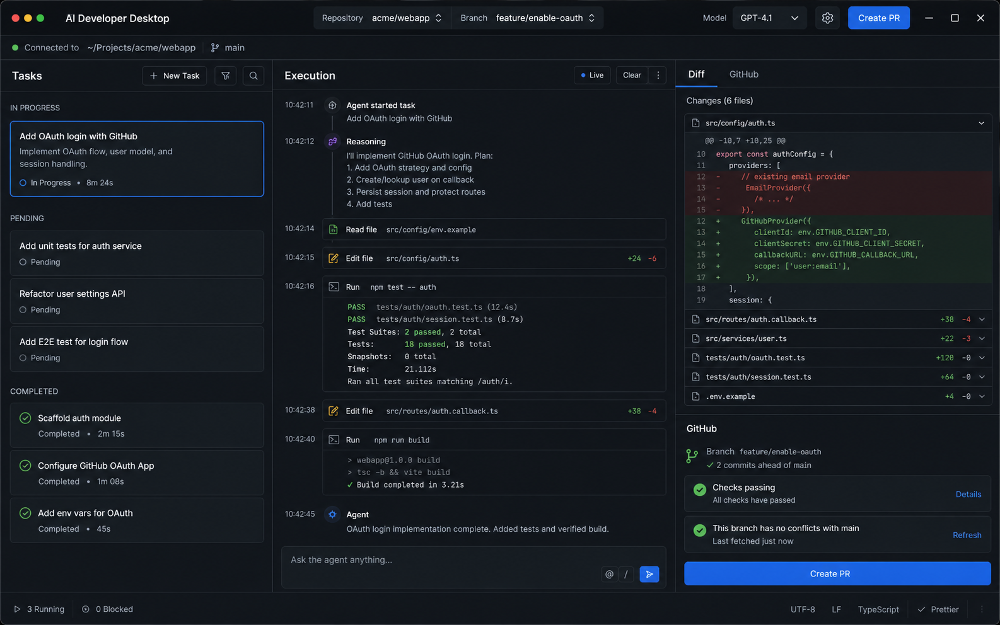

# AI Developer Desktop

Desktop AI coding product for macOS and Windows. The app launches a local Python coding agent, connects to a local Git repository, streams execution events, shows diffs/results, and helps create GitHub pull requests.

The product direction is a developer cockpit in the spirit of Claude Code and Codex: task-oriented, transparent, local-first, and GitHub-aware.



## MVP Scope

- Connect a local Git repository.
- Create a coding task from the desktop app.
- Launch the local Python agent as a sidecar process.
- Stream live execution events into the UI.
- Inspect changed files and diff/result output.
- Commit and create a GitHub draft PR.
- Ship localized UI strings for `ru`, `en`, `es`, and `pt-BR`.
- Package development builds for macOS and Windows.

## Stack

- Desktop shell: Electron, React, Vite, TypeScript.
- UI: code-native React components, CSS tokens, lucide icons, Monaco-ready layout.
- Runtime: Python 3.12+ local agent sidecar.
- IPC: Electron preload bridge with typed JSON events.
- Storage: SQLite planned for tasks, runs, settings, and repositories.
- Git: native `git` CLI wrapped by desktop services.
- GitHub: OAuth/PAT for MVP, GitHub App later.
- AI providers: adapter interface for OpenAI, Anthropic, local/Ollama later.
- Packaging: electron-builder for macOS and Windows.
- Tests: Vitest, Playwright, pytest.
- Localization: i18next-style JSON dictionaries plus `scripts/check_i18n.mjs`.

## Repository Layout

```txt
apps/desktop/       Electron + React desktop app
agent/              Python local coding agent skeleton
packages/shared/    Shared TypeScript event contracts
docs/               Product spec, architecture, roadmap, security, release notes
scripts/            Project automation helpers
```

## Quick Start

```bash
npm install
npm run dev
```

Python agent development:

```bash
cd agent
python -m venv .venv
.venv/Scripts/activate
pip install -e ".[dev]"
python -m ai_dev_agent.cli --repo .. --task "Inspect repository"
```

## Important Docs

- [SPEC.md](SPEC.md) - product and MVP specification.
- [docs/TECH_STACK.md](docs/TECH_STACK.md) - stack decisions.
- [docs/ARCHITECTURE.md](docs/ARCHITECTURE.md) - system architecture.
- [docs/TASKS.md](docs/TASKS.md) - parallel team tasks.
- [docs/LOCALIZATION.md](docs/LOCALIZATION.md) - localization rules.
- [docs/SECURITY.md](docs/SECURITY.md) - desktop and agent safety model.
