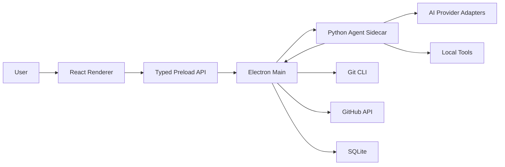

# Architecture

## High-Level Diagram



## Process Model

### Renderer

- React UI only.
- No Node.js access.
- Receives typed events from preload.
- Shows tasks, execution feed, diffs, settings, and GitHub status.

### Preload

- Small allowlisted bridge.
- Exposes safe methods:
  - `selectRepository`
  - `startAgentRun`
  - `stopAgentRun`
  - `onAgentEvent`
  - `getGitStatus`

### Electron Main

- Owns native desktop APIs.
- Starts/stops Python sidecar.
- Wraps Git and GitHub calls.
- Stores local app data.
- Enforces permission checks.

### Python Agent

- Accepts task, repo path, model route, and run ID.
- Uses provider adapters for model calls.
- Uses tool adapters for file, shell, Git, and tests.
- Emits newline-delimited JSON events.
- Never talks directly to renderer.

## Event Contract

The sidecar is launched as:

```bash
python -m ai_dev_agent.cli --repo <path> --task "<task>" --model <model> --run-id <run_id>
```

It emits JSONL events:

```json
{"id":"evt_1","runId":"run_1","type":"task.started","ts":"2026-06-29T20:00:00.000Z","message":"Task started"}
```

All events must include:

- `id`
- `runId`
- `type`
- `ts`
- optional `message`
- optional structured `payload`

## Data Boundaries

- Secrets: OS keychain/credential manager.
- Task/run metadata: SQLite.
- Repo content: local filesystem only.
- GitHub data: fetched only after user auth.
- Provider prompts and outputs: logged with redaction.

## Safety Boundaries

- Renderer cannot spawn processes.
- Agent cannot perform destructive actions without permission from main process/user.
- Git operations are explicit and visible.
- Tool arguments are validated in code.
- Agent loop is bounded by step, time, and cost limits.
